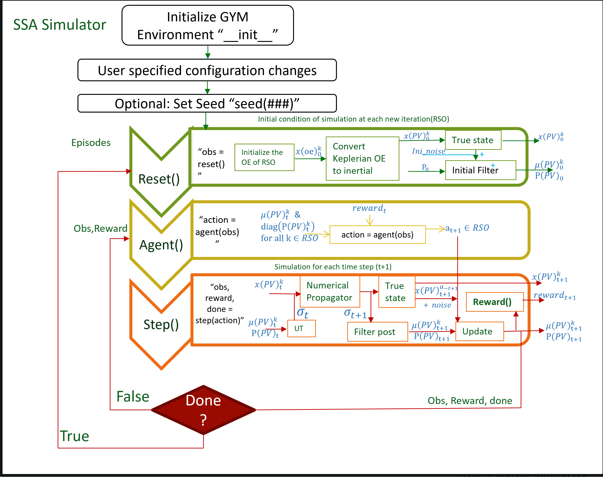

# ssa-gym : an OpenAI Gym environment for tasking Space Situational Awareness Sensors and some associated agents.

Original repository author : Maj. Ashton Harvey, Devayani Pawar

The repository includes:
* [Library of Astro-Transformation functions](envs/transformations.py)
* [Source code for the Simulation and Plots](envs/ssa_tasker_simple_2.py)
* [Implementation of Dynamic functions](envs/dynamics.py)
* [Library of Reward function](envs/reward.py)
* [Library of Heuristic agents](agents.py)
* [Test Cases](tests.py)
* [Results](envs/results.py)

## Requirements
Python 3.6, and other common packages listed in `requirements.txt`.

## Installation
1. Clone this repository
2. Install dependencies
   ```bash
   pip3 install -r requirements.txt
   ```
   
## Data 

Data is gathered from [International Earth Rotation and Reference System Service](https://www.iers.org/). We are using the
Earth Orientation data for this research. You can see the format of the dataset [here](https://data.iers.org/products/39/640/orig/eopc04.62-now).
 

## Getting Started:

- Setting up the simulation:[Register's environment with Gym](envs/__init__.py )
- Propagator 
- Reset and Step function 
- Reward
- Action

#### Key Concepts used:
- [Deep Reinforcement Learning](https://spinningup.openai.com/en/latest/)
- Orbital Dynamics
- [Kalman Filter for uncertain information](https://www.bzarg.com/p/how-a-kalman-filter-works-in-pictures/)
  - [Unscented Kalman Filter](https://towardsdatascience.com/the-unscented-kalman-filter-anything-ekf-can-do-i-can-do-it-better-ce7c773cf88d): UKF
is able to provide better estimates given the nonlinearity of the orbital dynamics
of the satellites.

#### Libraries used
- Reinforcement Learning in python: https://gym.openai.com/docs/
- FilterPy - Python library that implements a number of Bayesian filters, most notably Kalman filters: https://filterpy.readthedocs.io/en/latest/
- Numba - An open source JIT compiler that translates a subset of Python and NumPy code into fast machine code: http://numba.pydata.org/
- Astropy - A Community Python Library for Astronomy: https://www.astropy.org/
- ERFA (Essential Routines for Fundamental Astronomy) is a C library containing key algorithms for astronomy, and is based on the SOFA library published by the International Astronomical Union (IAU) https://github.com/liberfa/erfa
- Poliastro - An open source collection of Python subroutines for solving problems in Astrodynamics and Orbital Mechanics: 
https://docs.poliastro.space/en/stable/about.html 
- RLlib - RLlib is an open-source library for reinforcement learning that offers both high scalability and a unified API for a variety of applications : https://docs.ray.io/en/master/rllib.html
     - *Bonus* - RLlib is a library built on top of Ray core: https://docs.ray.io/en/master/ray-overview/index.html
    

## Model




## Citation
```
@misc{ssa-gym_2020,
  title={An OpenAI Gym environment for tasking Space Situational Awareness Sensors and some associated agents.
},
  author={Maj. Ashton Harvey, Devayani Pawar},
  year={2020},
  publisher={Github},
  journal={GitHub repository},
  howpublished={\url{https://github.com/AshHarvey/ssa-gym}},
}
```

## Acknowledgement

