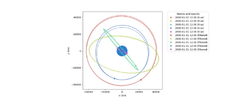

# ssa-gym : an OpenAI Gym environment for tasking Space Situational Awareness Sensors and some associated agents.
Motivation: This work lays out a method for training a DRL based policy which can perform onlinesensor tasking

Repository author : Maj. Ashton Harvey, Devayani Pawar

## What is SSA ?
Space Situational Awareness (SSA) is the identification of hazards in space via measuring and predicting the kinematic state and characteristics of space objects (SOs). It is also commonly known as Space Domain Awareness (SDA).  Active topics of research in this area include, but are not limited to:


The repository includes:
* [Source code for the SSA-GYM Simulation](envs/ssa_tasker_simple_2.py)
* [Library of Astro-Transformation functions](envs/transformations.py)
* [Implementation of Dynamic functions](envs/dynamics.py)
* [Library of Reward function](envs/reward.py)
* [Library of Heuristic agents](agents.py)
* [Test Cases](tests.py)
* [Results](envs/results.py)
* [Visualizations](envs/visualizations.py)

## Requirements
Python 3.6, and other common packages listed in `requirements.txt`.

## Installation
1. Clone this repository
2. Install dependencies
   ```bash
   pip3 install -r requirements.txt
   ```
   
## Data 

Data is gathered from [International Earth Rotation and Reference System Service](https://www.iers.org/). We are using the
Earth Orientation data for this research. You can see the format of the dataset [here](https://data.iers.org/products/39/640/orig/eopc04.62-now).
 
## Preparing the Data

For right simulation of RSO
- We transform the location of an object with respect to the surface of the Earth (ITRS) to a  satellite  in  orbit  around  the  Earth  (GCRS) or vice-versa
- We transform the data to obtain longitude & latitude.
- We transform the data to obtain the Azimuth, Elevation,and Slant Range (topocentric coordinate reference system) a way to relate an observer on the ground to an object it can observe in the sky.  

[Check this](https://ww2.mathworks.cn/help/map/choose-a-3-d-coordinate-system.html)

## Getting Started

- Setting up the simulation: [Register's environment with Gym](envs/__init__.py )

#### Key Concepts used:
- [Deep Reinforcement Learning](https://spinningup.openai.com/en/latest/)
- [Orbital Mechanics](https://en.wikipedia.org/wiki/Orbital_mechanics)
- [Kalman Filter for uncertain information](https://www.bzarg.com/p/how-a-kalman-filter-works-in-pictures/)
  - [Unscented Kalman Filter](https://towardsdatascience.com/the-unscented-kalman-filter-anything-ekf-can-do-i-can-do-it-better-ce7c773cf88d): UKF
is able to provide better estimates given the nonlinearity of the orbital dynamics
of the satellites.

#### Libraries used
- Reinforcement Learning in python: https://gym.openai.com/docs/
- FilterPy - Python library that implements a number of Bayesian filters, most notably Kalman filters: https://filterpy.readthedocs.io/en/latest/
- Numba - An open source JIT compiler that translates a subset of Python and NumPy code into fast machine code: http://numba.pydata.org/
- Astropy - A Community Python Library for Astronomy: https://www.astropy.org/
- ERFA (Essential Routines for Fundamental Astronomy) is a C library containing key algorithms for astronomy, and is based on the SOFA library published by the International Astronomical Union (IAU) https://github.com/liberfa/erfa
- Poliastro - An open source collection of Python subroutines for solving problems in Astrodynamics and Orbital Mechanics: 
https://docs.poliastro.space/en/stable/about.html 
- RLlib - RLlib is an open-source library for reinforcement learning that offers both high scalability and a unified API for a variety of applications : https://docs.ray.io/en/master/rllib.html
     - *Bonus* - RLlib is a library built on top of Ray core: https://docs.ray.io/en/master/ray-overview/index.html
    

## Model


## Visualization



## Future Work

Here are some of the changes I am going to recommend in an upcoming paper as future work:
- Add support for the variable-step Gauss–Legendre implicit-Runge–Kutta-based approach for orbit and uncertainty propagation
-- This is a more accurate field propagator that can leverage commonalities of the points that need to be propagated by the filter to speed processing
- Conversion of the core state from cartesian (GCRS's inertial frame) to J2 Equinoctial Orbit Elements
-- This will greatly improve the performance of the UKF as the J2EqOE state representation is far more conducive to representing the true shape of the covariance vice its cartesian representation
-- I suspect this will also greatly reduce the numerical instabilities that form in the unscented transform which can result in non-singular covariance matrices which I handle with covariance inflation in the current model, but can occasionally crash a run
- Consider replacement of the UKF with a Gauss von Mises distribution filter
-- This will provide moderate gains in covariance realism over a J2EqOE UKF

Suggested helpful resources for future work:
[J. M. Aristoff, J. T. Horwood, and K. T. Alfriend, “On a set of J2 equinoctial orbital elements and their use for uncertainty propagation,” Celestial Mechanics and Dynamical Astronomy, vol. 133, pp. 9-27, 2021.](https://rdcu.be/cgu4e)

[A.B. Poore, J. M. Aristoff, and J. T. Horwood, “Covariance and uncertainty realism in space surveillance and tracking.” Astrodynamics Innovation Committee. Tech. Rep. AD1020892, 2016](https://s11967.pcdn.co/wp-content/uploads/2019/10/Covariance-and-Uncertainty-Realism.pdf)

[J. M. Aristoff, J. T. Horwood, and A. B. Poore, “Implicit Runge-Kutta-based methods for fast, precise, and scalable uncertainty propagation,” Celestial Mechanics and Dynamical Astronomy, vol. 122, pp. 169-182, 2015.](https://link.springer.com/article/10.1007/s10569-015-9614-7)

[J. T. Horwood and A. B. Poore, “Gauss von Mises distribution for improved uncertainty realism in space situational awareness,” SIAM Journal of Uncertainty Quantification, vol. 2, pp. 276-304, 2014.](https://s11967.pcdn.co/wp-content/uploads/2019/10/Numerica_SIAMJUQ_2_2014_Gaus.pdf)

[J. M. Aristoff, J. T. Horwood, N. Singh, and A. B. Poore, “Nonlinear uncertainty propagation in orbital elements and transformation to Cartesian space without loss of realism,” Proc. of the 2014 AAS/AIAA Astrodynamics Specialist Conference, (San Diego, CA), Aug. 2014.](https://s11967.pcdn.co/wp-content/uploads/2019/10/Numerica_AIAA-2014-4167_NonLinear-Uncertainty.pdf)

[J. T. Horwood, J. M. Aristoff, N. Singh, A. B. Poore, and M. D. Hejduk, “Beyond covariance realism: a new metric for uncertainty realism,” Proc. of the SPIE, Signal and Data Processing of Small Targets, vol. 9092, (Baltimore, MD), May 2014.](https://s11967.pcdn.co/wp-content/uploads/2019/10/Numerica_SPIE_9092_2014a_Beyond-Covariance.pdf)

[J. T. Horwood, J. M. Aristoff, N. Singh, and A. B. Poore, “A comparative study of new non-linear uncertainty propagation methods for space surveillance,” Proc. of the SPIE, Signal and Data Processing of Small Targets, vol. 9092, (Baltimore, MD), May 2014.](https://s11967.pcdn.co/wp-content/uploads/2019/10/Numerica_SPIE_9092_2014b_NonLinear-Uncertianty.pdf)

[J. M. Aristoff, J. T. Horwood, and A. B. Poore, “Orbit and uncertainty propagation: a comparison of Gauss-Legendre-, Dormand-Prince-, and Chebyshev-Picard-based approaches,” Celestial Mechanics and Dynamical Astronomy, vol. 117, pp. 13-28, 2013.](https://s11967.pcdn.co/wp-content/uploads/2019/10/Numerica_CMDA_117_2013_Orbital-1.pdf)

[J. T. Horwood, N. D. Aragon, and A. B. Poore, “Gaussian sum filters for space surveillance: theory and simulations,” Journal of Guidance, Control, and Dynamics, vol. 34, pp. 1839-1851, 2011.](https://s11967.pcdn.co/wp-content/uploads/2019/10/Numerica_AAS-12-159_Space-object-manuever.pdf)

## Citation
```
@misc{ssa-gym_2020,
  title={An OpenAI Gym environment for tasking Space Situational Awareness Sensors and some associated agents.
},
  author={Maj. Ashton Harvey, Devayani Pawar},
  year={2020},
  publisher={Github},
  journal={GitHub repository},
  howpublished={\url{https://github.com/AshHarvey/ssa-gym}},
}
```


