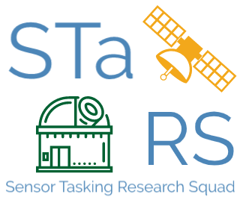
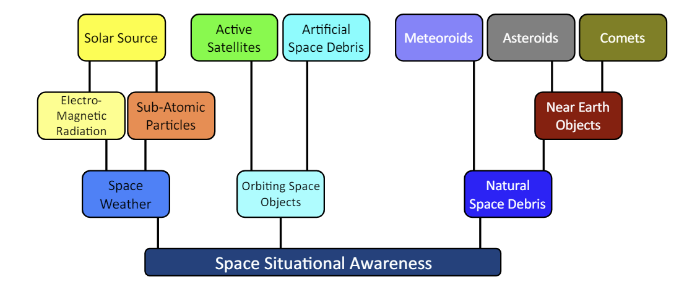

# ssa-gym : an OpenAI Gym environment for tasking Space Situational Awareness Sensors and some associated agents.
Motivation: This work lays out a method for training a DRL based policy which can perform onlinesensor tasking

Repository author : Maj. Ashton Harvey, Devayani Pawar

## What is SSA ?
Space Situational Awareness (SSA) is the identification of hazards in space via measuring and predicting the kinematic state and characteristics of space objects (SOs). It is also commonly known as Space Domain Awareness (SDA).  Active topics of research in this area include, but are not limited to:


### Orbit Tracking using Kalman Filters

The repository includes:
* [Source code for the SSA-GYM Simulation](envs/ssa_tasker_simple_2.py)
* [Library of Astro-Transformation functions](envs/transformations.py)
* [Implementation of Dynamic functions](envs/dynamics.py)
* [Library of Reward function](envs/reward.py)
* [Library of Heuristic agents](agents.py)
* [Test Cases](tests.py)
* [Results](envs/results.py)
* [Visualizations](envs/visualizations.py)

## Requirements
Python 3.6, and other common packages listed in `requirements.txt`.

## Installation
1. Clone this repository
2. Install dependencies
   ```bash
   pip3 install -r requirements.txt
   ```
   
## Data 

Data is gathered from [International Earth Rotation and Reference System Service](https://www.iers.org/). We are using the
Earth Orientation data for this research. You can see the format of the dataset [here](https://data.iers.org/products/39/640/orig/eopc04.62-now).
 
## Preparing the Data

For right simulation of RSO
- We transform the location of an object with respect to the surface of the Earth (ITRS) to a  satellite  in  orbit  around  the  Earth  (GCRS) or vice-versa
- We transform the data to obtain longitude & latitude.
- We transform the data to obtain the Azimuth, Elevation,and Slant Range (topocentric coordinate reference system) a way to relate an observer on the ground to an object it can observe in the sky.  

[Check this](https://ww2.mathworks.cn/help/map/choose-a-3-d-coordinate-system.html)

## Getting Started

- Setting up the simulation: [Register's environment with Gym](envs/__init__.py )

#### Key Concepts used:
- [Deep Reinforcement Learning](https://spinningup.openai.com/en/latest/)
- Orbital Dynamics
- [Kalman Filter for uncertain information](https://www.bzarg.com/p/how-a-kalman-filter-works-in-pictures/)
  - [Unscented Kalman Filter](https://towardsdatascience.com/the-unscented-kalman-filter-anything-ekf-can-do-i-can-do-it-better-ce7c773cf88d): UKF
is able to provide better estimates given the nonlinearity of the orbital dynamics
of the satellites.

#### Libraries used
- Reinforcement Learning in python: https://gym.openai.com/docs/
- FilterPy - Python library that implements a number of Bayesian filters, most notably Kalman filters: https://filterpy.readthedocs.io/en/latest/
- Numba - An open source JIT compiler that translates a subset of Python and NumPy code into fast machine code: http://numba.pydata.org/
- Astropy - A Community Python Library for Astronomy: https://www.astropy.org/
- ERFA (Essential Routines for Fundamental Astronomy) is a C library containing key algorithms for astronomy, and is based on the SOFA library published by the International Astronomical Union (IAU) https://github.com/liberfa/erfa
- Poliastro - An open source collection of Python subroutines for solving problems in Astrodynamics and Orbital Mechanics: 
https://docs.poliastro.space/en/stable/about.html 
- RLlib - RLlib is an open-source library for reinforcement learning that offers both high scalability and a unified API for a variety of applications : https://docs.ray.io/en/master/rllib.html
     - *Bonus* - RLlib is a library built on top of Ray core: https://docs.ray.io/en/master/ray-overview/index.html
    

## Model


## Citation
```
@misc{ssa-gym_2020,
  title={An OpenAI Gym environment for tasking Space Situational Awareness Sensors and some associated agents.
},
  author={Maj. Ashton Harvey, Devayani Pawar},
  year={2020},
  publisher={Github},
  journal={GitHub repository},
  howpublished={\url{https://github.com/AshHarvey/ssa-gym}},
}
```


